[Read in Russian](README_RU.md)
# FlashCardsMe - Studying using the Flash Cards

## What is this program? 

FlashCardsMe is a simple program for learning information using Flash Cards. It can be used for learning foreign languages (in particular, for memorizing words, alphabets, characters), memorizing place names, visual images, recognizing words by hearing and in other similar cases.

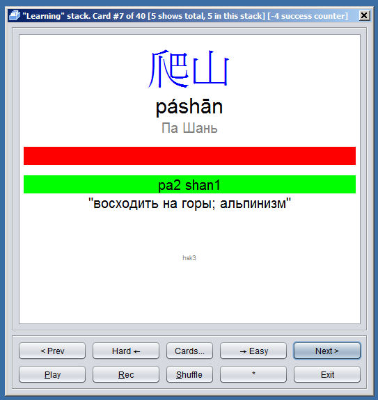

Flash Card is a virtual piece of cardboard, where there is a question on the front side (such as a word in a foreign language) and answer on the back side (i.e. translation of the word). The program shows the front side, and prompts you to enter an answer, and then shows the reverse side, controlling the correctness of the answer. During learning process, the program allows you to group cards in a stacks like “Easy”, “Learned”, “Difficult” etc. while not solving for the user, which cards to show and in which order, when to consider them memorized, etc. The entire learning process is under control of the trainee. The program, thus, provides a number of powerful and flexible tools of control over the learning process.

## Installation

FlashCardsMe written in Java using the Swing library that allows a program to run on many platforms.

To begin, you should install the Java runtime environment 8. At the moment, the latest official version of the runtime is [here](http://www.oracle.com/technetwork/java/javase/downloads/index.html).

Then you need to download the zip file with the program [here](https://github.com/AntonOvsyannikov/FlashCardsMe/raw/master/FlashCardsMe.zip).

Unpack the zip archive and click FlashCardsMe.jar to run the program. Make sure first, that jar extension is associated with Java runtime.

You can also look into [Sample Decks](https://github.com/AntonOvsyannikov/FlashCardsMe/tree/master/SampleDeck) folder in this repository and download examples of decks.

## Main features

### The Cards, Decks, Stacks

Flash Card is a virtual piece of cardboard, where there is a question on the front side (such as a word in a foreign language) and answer on the back side (i.e. translation of the word). The program shows the front side, and prompts you to enter an answer, and then shows the reverse side, controlling the correctness of the answer. If the answer is correct several times, the card is marked as successfully memorized, and the program offers to move it to next Stack. On the contrary, if the card is difficult - the program offers to move it to “difficult to memorize” stack. You can return later to this Stack. Cards can be moved from one stack to another at any time, in various ways, i.e. in random order. This is key difference of FlashCardsMe program from many other programs, where the cards are shuffled to display on a mysterious algorithm. In FlashCardsMe The Stack where the card is resides, is strictly defined, and the user decides where to put the card. That gives you full control over the learning process.

There are 6 standard stacks, which forms so-called Learning Path:

* **Deck** - the starting stack, where all the new cards are placed
* **Learning** - the main stack, in which the learning process mainly occurs
* **Easy** - almost learned cards
* **Learned** - learned card
* **Hard** - cards, difficult to remember
* **Hardest** - very difficult cards

In addition, the program allows you to create custom stacks, and mark cards as “Favorites”. You can always learn the particular stack (i.e. review already learned cards) or mix of the cards from one stack to another.

### Deck data and Templates

The data for the Deck is a table with a header. Columns forms fields, and the lines are the raw data, which converted into the card using the template. Template is a description of how each field is represented on the front and the back side of the Flash Card.

Sometimes you need to swap the question and the answer. The program allows you to create multiple templates to achieve this.

### Cards and images

To display the cards the program uses the HTML internally, which allows you to use different colors, font sizes, special characters, and insert images.

### Audio

Program can play sound files, while showing front or back of the card. Also it allows you to record pronunciation with the microphone to compare it with the reference.

Audio channel of memorization is very important in the learning process.

### Statistics on Cards and Stacks

For all cards, statistics are kept for the total number of demonstrations, as well as how long the cards was in particular stack. For each stack, statistics on its size are maintained.

This allows you to visually observe how quickly you are learning cards.

### Filters

FlashCardsMe provides possibility to filter cards (if deck developer have provided corresponding fields). For example, in the study of words, you can display only verbs or only nouns.

### Keyboard input

It is important to note, that the learning with cards becomes much more effective if answer is entered from the keyboard, because the fine motor skills is added to visual and aural channels of memorization. FlashCardsMe enables you to use such opportunity.

## Tutorials

The following two small guides will shows you how to study with ready Deck, as well as create your own Deck for FlashCardsMe.

## Tutorial 1 - Studying with the ready Deck

### Installation and start-up


To begin, you should install the Java runtime environment 8. At the moment, the latest official version of the runtime is [here](http://www.oracle.com/technetwork/java/javase/downloads/index.html).

Then you need to download the zip file with the program [here](https://github.com/AntonOvsyannikov/FlashCardsMe/raw/master/FlashCardsMe.zip).

Unpack the zip archive and click FlashCardsMe.jar to run the programm. Make sure first, that jar extension is associated with Java runtime.

Also, you need to download [here](https://github.com/AntonOvsyannikov/FlashCardsMe/raw/master/SampleDeck/states.jfc) a simple deck, through which we will learn the capitals of 10 states of the USA.

After starting the program you will see the main screen. There is list of available Decks, and some buttons that allow us to create, import or export the decks, as well as edit, rename or delete them. The first step is to import the deck, loaded from web site. Push the button "Import ..." and select the file with the deck. The deck appears in the list under the name "states.jfc". Rename it to "States". To do this, select the deck, press "Rename..." and type the new name "States".


Done!

### Studying cards

It's time to start studying! Choose the deck, and then click "Learn!”, and we go to the learning screen.


On the learning screen, we see the buttons for the 6 default stacks. Recall their functions:

* **Deck** - the starting stack, where all the new cards are placed
* **Learning** - the main stack, in which the learning process mainly occurs
* **Easy** - almost learned cards
* **Learned** - learned card
* **Hard** - cards, difficult to remember
* **Hardest** - very difficult cards

We have 20 cards in the deck in total. Half of them proposes us to enter the name of the state capital, and the second on the contrary - to define the state by it’s capital. All cards are initially placed to the "Deck" stack.

By clicking on the stack (stack button), demonstration of cards begins in the order in which they are in the stack. You can show cards in the stack "Deck", if you wish, but it is better to move a few cards to the "Learning" stack and then shuffle it. It is not recommended to shuffle the "Deck" itself, since cards can be arranged in particular order, for example by increasing complexity. So, click "(↓)" between the "Deck" and "Learning" stacks, and transfer 10 random cards to "Learning" stack.

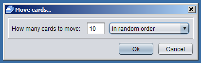

We now have 10 cards in the "Deck" and "Learning". Once you learn all 10 cards, you can add cards from "Deck" stack . But you can do it anytime, you are responsible for determining the course of the learning process. However, we will proceed to study the cards by clicking "Learning" button.

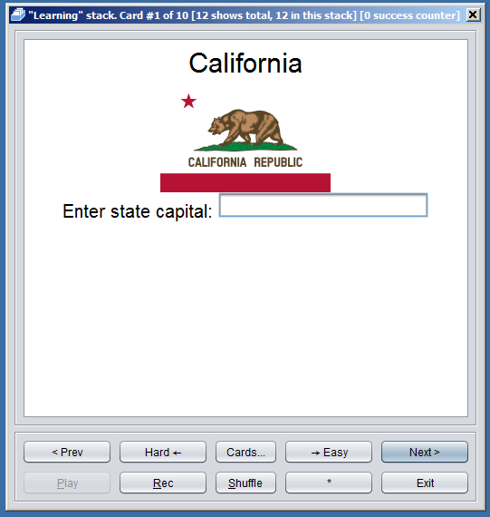

We got the card, which is prompted to enter the name of the state capital of California.

Postpone the task for later. Now let’s take a look at the control panel, which is located in the lower part of the window.

* "<Prev", "Next>” - with these buttons we can go to the previous or next card in the stack. Note, if you press “Next>” the back side of the card is displayed first.
* "← Hard", "Easy →” - these buttons moves the card to the neighboring stacks. If you gave wrong answer several times left button becomes yellow, and then red. Same for right answer and right button.
* "Cards ..." - opens a window with a list of cards, will describe the window later.
* "Shuffle" - shuffle the stack.
* "\*" \- marks the card as "Favorites". Then this card appears in a special "Favorites" stack .
* "Play" - if the card is with audio - plays it again.
* "Rec" - allows you to record from a microphone your pronunciation to compare it with the reference.

Now look at the window title, it presents some useful information about the card and the stack.

* "Learning" stack - the name of the stack.
* Card # 1 of 10 - the first card of the 10 in the stack
* \[12 shows total, 12 in this stack\] - shows the number of times the card was demonstrated in total and in this particular stack.
* \[0 success counter\] - shows the balance of right and wrong answers. The counter is used to highlight the button, which proposes to transfer card to next stack.

Now we will try to do the job. The correct answer is "Sacramento", but let's see what happens if we enter the wrong answer. Type, for example, "Scramento" and press "Enter".

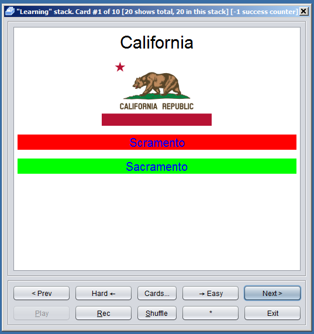

On the reverse side we see right and wrong answer. Just see decreased by 1 success counter.

Now let's try to enter the answer several times correctly.

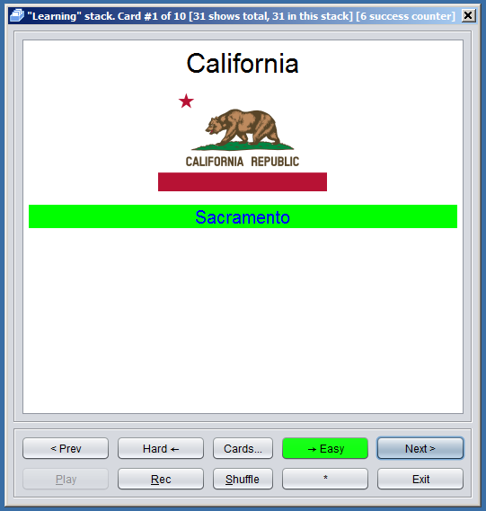

After the third time Easy button will turn yellow, and after the 6th - green. That’s it! We have  learned this card, it is time to move it to "Easy" stack, by clicking on a green button!

Let’s continue training with other cards. After a while, most of the cards will be placed to “Easy” stack. It's time to review the learned cards. Exit cards screen and to "Easy" button in the learning screen. First, shuffle stack and then go through the memorized cards. Now, if answered correctly, the system proposes to shift some cards to "Learned" stack. But if some cards are forgotten and you making mistakes while typing answer the system will propose to transfer such cards back to the "Learning" stack.

The process is repeated until all the cards will be in the stack "Learned". Done! We learn state capitals!

Now let's see on additional features.

### Learning sessions

Learning sessions are useful when several people are studying the same deck or you just want to experiment with cards without losing it’s order in the stacks. There is “Learning session” section on the top of the learning screen. You can always start the new one by pressing “(+)” button.

### Filters

"Filter" button in the Learning window allows you to choose which cards to show in the current session. Filter button opens the filter editing window.

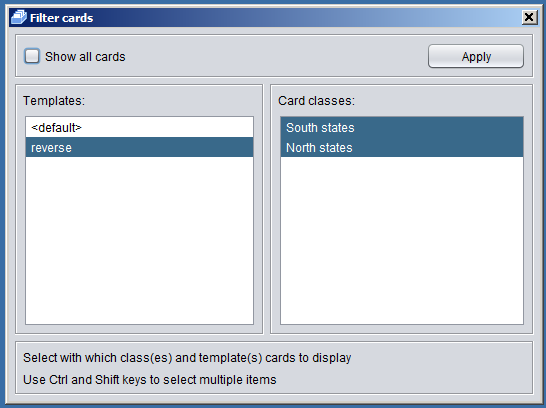

Uncheck the checkbox "Show all". You can now choose which cards to show.

If the deck has several templates (in this case two of them - with questions about the capital of the particular state, and vice versa) in the left window, you can select (using the Shift key) cards with which templates to show.

If deck has partition classes (in this case, the card corresponding to the Southern and Northern states) in the right window we will be able to choose which of them to show.

When finished, press "Apply" button.

Classes useful in studying words to split them to verbs, nouns, etc.

### Cards and Stacks window

Click on "Cards ..." on the learning screen to open Cards and Stacks window. Here we can create and delete custom stacks, transfer cards from one stack to another, view statistics on each card or stack. This gives a powerful analytical tool for the analysis of the learning process.

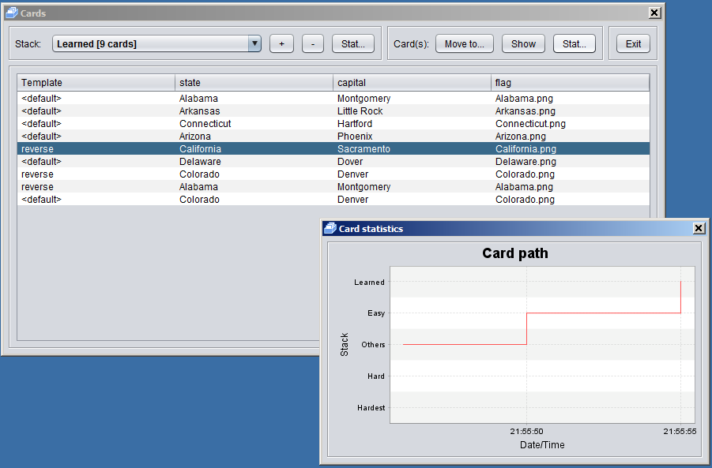

## Tutorial 2 - Making own deck

### Simple Deck

Now let’s make our own deck. Actually it will be the Deck used in first tutorial.

First, we need raw data - list of the 10 states and their capitals. This data can be edited in a spreadsheet application, then exporting to CSV. In our case, when the deck is small, it can be done in the program itself. Or we can create a CSV file in any text editor. Do not forget to specify when saving the correct Unicode format.

So let’s create the 'states.txt' file with Notepad. It should contain the following:

```
state,capital
Alabama,Montgomery
Alaska,Juneau
Arizona,Phoenix
Arkansas,Little Rock
California,Sacramento
Colorado,Denver
Connecticut,Hartford
Delaware,Dover
Florida,Tallahassee
Georgia,Atlanta
```

Save file in UTF-8 (File / Save As / UTF-8 )

Run FlashCardsMe and press the button (+) (to create a new deck). Enter the name of the deck (States), and press (OK). We see that in the list there is a new deck.


Click "Edit ..." button. “Edit Deck” window appears. Press “CSV…” button in the “Import” section. File chooser window appears. Select just created csv file. “Import CSV” window appears. Since the default encoding is ANSI, but file is saved in UTF-8 (do not forget to do so, if your file contains Russian letters, for example) there is trash on the screen. We need to choose the correct character encoding (UTF-8) and the delimiter (Delimiter: <,>) and then press “Reload”. That’s it, the file is ready for import.


On this screen you can also specify how columns of the table will be named. Also you can specify the “primary key” field to update the data instead of reloading everything.

Push the button (Import) and return to the deck editing screen.

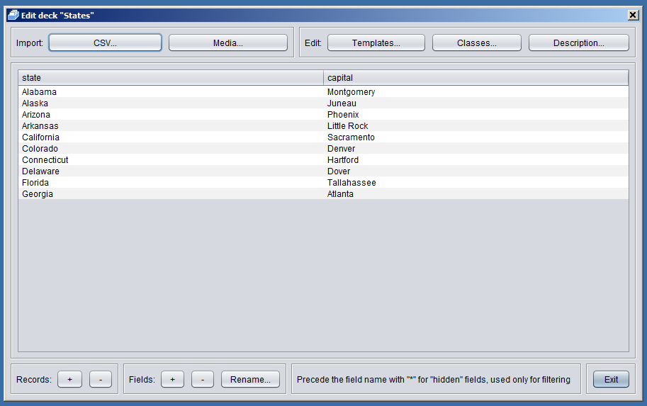

With the help of this screen in the future we can add or remove cards (Records (+) (-)) or fields. For example, we will add state flag field later.

Now we need to determine how the front and back of the card will look like. We achieve this with help of Templates. Click "Templates" button.


There is list of templates on the top. We are editing the default template. Below there is representation of the Front (Question) and Back (Answer) side of the card. For each field of our data (in this case, "state" and "capital"), we can set up the display mode ("What to do" column). By default, all fields are hidden.

Edit the template as shown in the figure.

For the front side we need to display state name ( "state": "Text") and put the input field for state capital ( "capital": "Type"). The question for the input field is entered in the column "Prompt". Also decrease font size "Font size": "20".

On the back side we again shows the state name ("state": "Text") and will compare the capital name with typed on the front side ( "capital": "Compare").

Click "Preview" to see how our cards looks now.


That’s it! Our first deck is ready!

However, let us consider some additional features provided by FlashCardsMe.

### Multiple templates

Sometimes you need to swap the question and the answer to enforce memorization. In our case we also wants to ask State name by it’s capital. To ensure this, the program provides the ability to create multiple templates. Just click on (+) in “Templates” window and create as many templates as you need. The total number of cards in the deck will be equal to the product of the number of entries in the data table on the number of templates. In our case, let's create another template, then the total number of cards in the deck will be equal to 20. Use the (↑) (↓) to change the display order of the fields.


### Cards Classes

When studying something with Flash Cards, sometimes it is convenient to break cards into groups. Thus, when studying words, it is convenient to break cards into nouns, verbs, and so on and study them separately. For this purpose, the program provides the concept of a card class. In our case, it is possible to separate states for the Southern and Northern regions. To do this, first you need to add the "class" field to the deck data table. We go to the editing screen of the deck, press "Fields: (+)", enter the name "\*class". Notice the asterisk at the beginning of the name. Since we need this field only for filtering, it’s good idea to hide it when editing templates. Asterisk will do so. Now enter the class to the new field for all states.


Then click the "Edit: Classes" button. Press the button (+) and enter the name of the class "South states". As a condition, we enter that the field "\*class" must contain (be equal) "South". We repeat the procedure for "North classes".

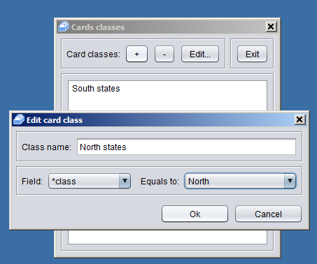

Done! Now our cards are divided into classes, and when studying the deck, we will be able to choose which states we will study.

### Images and Audio

When working with cards, various media are useful. When studying foreign languages, audio files, in which professional teachers say words or syllables, are invaluable. In our case, to strengthen associative links, we can display not only the state name, but also its flag. In FlashCardsMe, you can display images and play audio files when you show the front or back of the card. For example, let's show how to display the flag on the front side of the card.

First, we prepare the images of the flags (they can be downloaded from Wikipedia). The file names will be, say, "Name_Shtata.png". We will place all files with images in an arbitrary directory.

Next, go to the editing screen of the deck and add a new field "flag", in which we diligently enter the names of files with the image of the flag. Of course, it's more convenient to do this in a spreadsheet using formulas. It is this algorithm of work that we recommend - prepare the data for the deck in a table editor and then only import the data into the program. However, we have a small deck and can do everything manually.

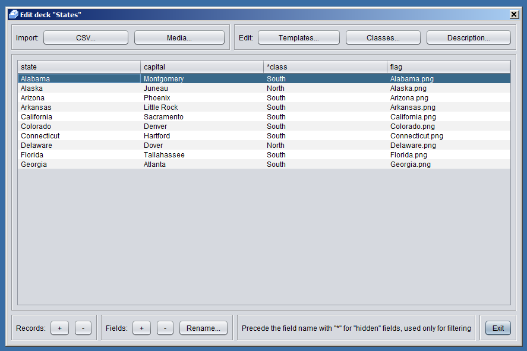

Next, you need to import media files directly into the deck. To do this, click the "Import: Media" button and select the prepared files. If you want to import the entire directory, go to the directory, press Ctrl-A or select several files using Shift-Click.

Now the flag should be displayed on the front side for the template "default" or on the reverse for the "reverse" template. Do this in the template editing window.


Let's look at the front and back of the default template.

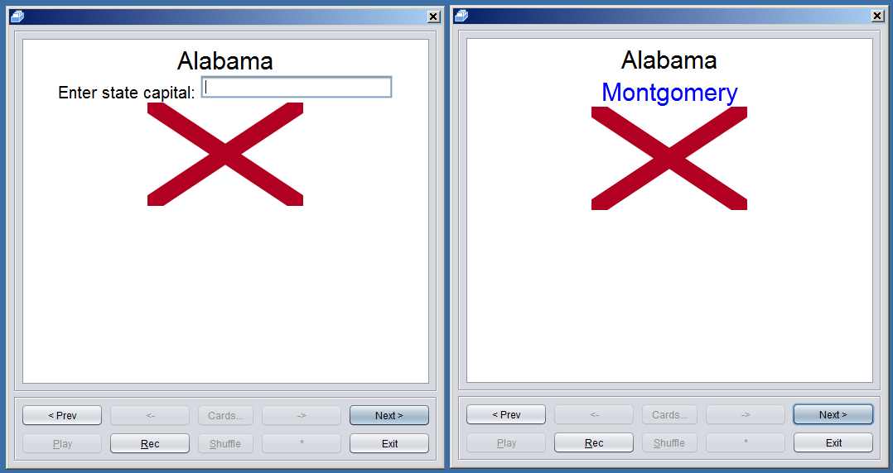

Done!

### Exporting the Deck

Thus, we have learned the basics of creating decks in FlashCardsMe. Now we should export the ready deck for distribution. The program FlashCardsMe will automatically pack decks data and all it's media files into a single archive, ready for distribution on forums or in some other way. To do this, go to the main screen of the program, select our deck and click the "Export ..." button. Select the directory and file name, click "Save". Our deck is ready! This is the file we used in the first lesson.
