[Read in English](README.md)
# FlashCardsMe - Обучение при помощи Карточек

FlashCardsMe - простая программа для запоминания разнообразной информации с использованием Обучающих Карточек (Flash Cards). Она может быть использована для изучения иностранных языков (в частности, для запоминания слов, алфавитов, иероглифов), запоминания географических названий, визуальных образов, определения слов на слух и в других подобных случаях.

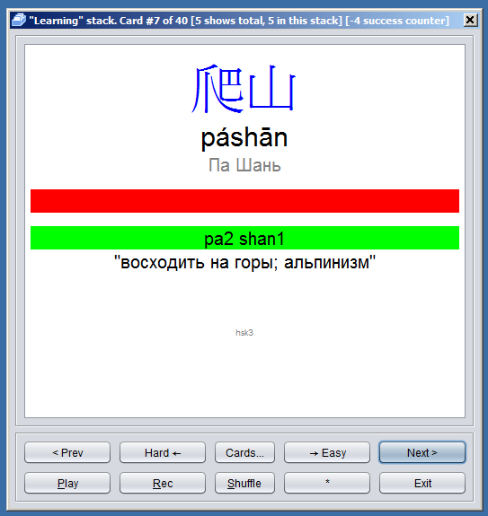

Обучающая Карточка \- это виртуальный кусочек картона, у которого на лицевой стороне написан вопрос, например слово на иностранном языке, а на обратной \- ответ. Программа демонстрирует лицевую сторону и предлагает ввести ответ, после чего демонстрирует оборотную сторону, контролируя правильность ответа. По мере заучивания программа позволяет группировать карточки в стопки, такие как “Выучено”, “Сложные” и т.п. При этом программа не решает за пользователя, какие карточки показывать и в каком порядке и когда считать их заученными. Весь контроль над процессом обучения обучения остается у обучаемого. Программа, при этом, предоставляет несколько мощных и гибких инструментов контроля над процессом обучения.

## Содержание
- [Что это за программа?](#p_1)
- [Установка](#p_2)
- [Основные возможности](#p_3)
  - [Карточки, Колоды, Стопки](#p_3_1)
  - [Данные и шаблоны](#p_3_2)
  - [Вид карточек и изображения](#p_3_3)
  - [Аудио](#p_3_4)
  - [Статистика по карточкам и стопкам](#p_3_5)
  - [Фильтры](#p_3_6)
  - [Клавиатурный ввод](#p_3_7)
- [Руководство 1 - Обучение по готовой колоде](#p_4)
  - [Установка и запуск](#p_4_1)
  - [Изучение карточек](#p_4_2)
  - [Сессии обучения](#p_4_3)
  - [Фильтры](#p_4_4)
  - [Окно работы с карточками и стопками](#p_4_5)
- [Руководство 2 - Изготовление колоды](#p_5)
  - [Простая колода](#p_5_1)
  - [Разные шаблоны](#p_5_2)
  - [Классы карточек](#p_5_3)
  - [Изображения и аудиофайлы](#p_5_4)
  - [Экспорт готовой колоды](#p_5_5)

<a name='p_2'></a>
## Установка

FlashCardsMe написана на Java с использованием библиотеки Swing, что дает возможность запускать программу на многих платформах.

Для начала необходимо установить среду исполнения Java 8. На текущий момент последняя официальная версия среды исполнения находится [здесь](http://www.oracle.com/technetwork/java/javase/downloads/index.html).

Затем необходимо скачать zip файл с программой [здесь](https://github.com/AntonOvsyannikov/FlashCardsMe/raw/master/FlashCardsMe.zip).

Распакуйте zip файл и щелкните на FlashCardsMe.jar чтобы запустить программу. Убедитесь, что расширение jar ассойиировано со средой исполнения Java.

Можно также заглянуть в директорию [Sample Decks](https://github.com/AntonOvsyannikov/FlashCardsMe/tree/master/SampleDeck) репозитория и скачать примеры колод.

<a name='p_3'></a>
## Основные возможности

<a name='p_3_1'></a>
### Карточки, Колоды, Стопки

Обучающая Карточка \- это виртуальный кусочек картона, у которого на лицевой стороне написан вопрос, например слово на иностранном языке, а на обратной \- ответ. Программа демонстрирует лицевую сторону и предлагает ввести (или проговорить про себя) ответ, после чего демонстрирует оборотную сторону с ответом. При этом если ответ несколько раз введен правильно, карточка помечается как успешно заученная, и программа предлагает переместить ее в соседнюю “стопку” (Stack). Напротив, если карточка “не дается” - программа предлагает переместить ее в стопку сложных для запоминания карточек, к которым можно вернуться позднее. Карточки можно перемещать из одной стопки в другую в любое время различными способами, например перемешав стопку и выбрав из нее карточки в случайном порядке. Именно это является отличием программы FlashCardsMe от многих других программ, где карточки перемешиваются для показа по некоему загадочному алгоритму. В FlashCardsMe стопка, где находится карточка, строго определена, и только пользователь решает, куда поместить карточку, что дает полный контроль над процессом обучения.

Всего в программе 6 стандартных стопок, формирующие так называемый Путь Обучения (Learning Path).

* **Deck (Колода)** - начальная стопка,куда помещаются все новые карточки
* **Learning** - основная стопка, в которой происходит обучение
* **Easy** - почти выученные карточки
* **Learned** - выученные карточки
* **Hard** - карточки, сложные для запоминания
* **Hardest** - очень сложные карточки

Кроме того, в программе можно создавать свои стопки, а также помечать карточки как “Избранные”, в этом случае они дублируются в особой стопке.

Вы можете в любой момент перейти к обучению по той или иной стопке (например сделать проверку уже выученных карточек) или смешать часть карточек из одной стопки с другой, и продолжить обучение (например, переложить часть сложных карточек или наоборот, изученных, обратно в основную стопку).

<a name='p_3_2'></a>
### Данные и шаблоны

Данные для колоды представлены в виде таблицы с заголовком. Столбцы формируют поля, а строки \- сырые данные, которые превращаются в карточку с помощью шаблона, где для каждого поля задается способ изображения на карточке для лицевой и оборотной стороны.

Иногда возникает необходимость поменять вопрос и ответ местами. Для этого в программе предусмотрена возможность создания нескольких шаблонов.

<a name='p_3_3'></a>
### Вид карточек и изображения

Для отображения карточек используется HTML, что позволяет применять разные цвета, размеры шрифтов, специальные символы, а также вставлять изображения.

<a name='p_3_4'></a>
### Аудио

Программа может воспроизвести серию звуковых файлов при демонстрации лицевой или оборотной стороны карточки (например “проговорить” иероглифы или буквы), а также дает возможность записать с микрофона Ваше произношение чтобы сравнить его с эталонным.

Слуховой канал запоминания очень важен в процессе обучения.

<a name='p_3_5'></a>
### Статистика по карточкам и стопкам

По всем карточкам ведется статистика по общему количеству показов, а также длительности пребывания в той или иной стопке.  Для каждой стопки ведется статистика ее размера.

Это позволяет наглядно наблюдать насколько быстро и с какими перерывами Вы заучиваете карточки.

<a name='p_3_6'></a>
### Фильтры

FlashCardsMe предоставляет возможность фильтрации карточек (если разработчик колоды предоставил соответствующие поля). Например, при изучении слов можно показывать только глаголы или только существительные.

<a name='p_3_7'></a>
### Клавиатурный ввод

Необходимо отметить, что обучение с помощью карточек становится намного эффективнее, если помимо проговаривания ответа про себя, он также вводится с клавиатуры. Это дает визуальному и слуховому запоминанию еще один канал для подкрепления \- мелкую моторику, что делает запоминание более успешным. FlashCardsMe предоставляет такую возможность.

<a name='p_4'></a>
## Руководство 1 - Обучение по готовой колоде

<a name='p_4_1'></a>
### Установка и запуск

Для начала необходимо установить среду исполнения Java 8. На текущий момент последняя официальная версия среды исполнения находится [здесь](http://www.oracle.com/technetwork/java/javase/downloads/index.html).

Затем необходимо скачать zip файл с программой [здесь](https://github.com/AntonOvsyannikov/FlashCardsMe/raw/master/FlashCardsMe.zip).

Распакуйте zip файл и щелкните на FlashCardsMe.jar чтобы запустить программу. Убедитесь, что расширение jar ассойиировано со средой исполнения Java.

Также необходимо скачать [здесь](https://github.com/AntonOvsyannikov/FlashCardsMe/raw/master/SampleDeck/states.jfc) простую колоду, при помощи которой мы выучим названия столиц 10 штатов США.

После запуска программы видим главный экран, где представлен список имеющихся колод и несколько кнопок, которые позволят нам создавать, импортировать или экспортировать колоды, а также редактировать, переименовывать или удалять их. Первым делом импортируем загруженную с сайта колоду. Нажимаем кнопку “Import...” и выбираем файл с колодой. Колода появляется в списке под именем “states.jfc”. переименуем колоду просто в “States”. Для этого выделяем колоду, нажимаем “Rename...” и вводим новое имя “States”.

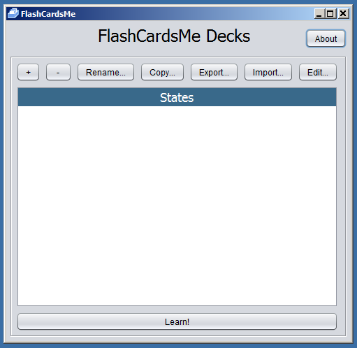

Готово!

<a name='p_4_2'></a>
### Изучение карточек

Самое время приступить к обучению, для этого выберем колоду и нажмем кнопку “Learn!” (или дважды щелкнем на названии колоды), и мы попадем на экран обучения.

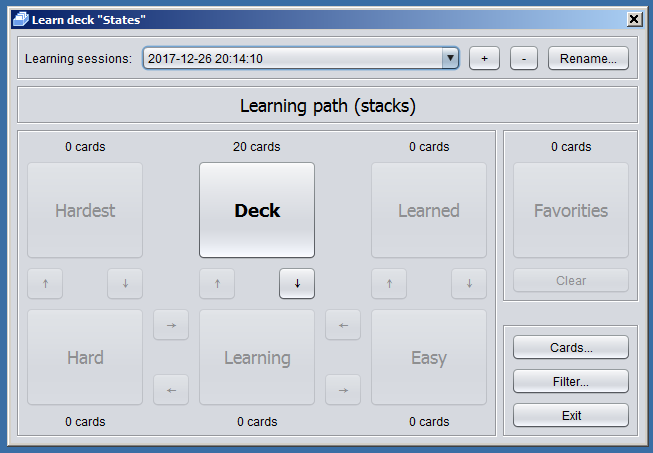

На экране обучения мы видим кнопки, соответствующие 6 стопкам, которые есть в программе по умолчанию. Напомним их функции:

* **Deck (Колода)** - начальная стопка,куда помещаются все новые карточки
* **Learning** - основная стопка, в которой происходит обучение
* **Easy** - почти выученные карточки
* **Learned** - выученные карточки
* **Hard** - карточки, сложные для запоминания
* **Hardest** - очень сложные карточки

Всего у нас в колоде 20 карточек, половина из них предлагает нам ввести название столицы штата, а вторая наоборот - определить штат по его столице. Все карточки изначально размещены в стопке “Deck”.

При нажатии на стопку (кнопку стопки), начинается демонстрация карточек в том порядке, в котором они лежат в стопке. При желании можно посмотреть карточки в стопке “Deck”, однако обучение лучше начинать с того, что переложить несколько карточек в стопку “Learning” и перемешать ее. Перемешивать стопку “Deck” не рекомендуется, так как в ней карточки могут быть расположены в каком то определенном порядке, например по возрастанию сложности. Итак, нажмем кнопку “(↓)” между стопками “Deck” и “Learning”, и перенесем 10 случайных карточек в стопку “Learning”.

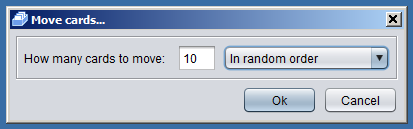

Теперь у нас по 10 карточек в “Deck” и “Learning”. После того, как мы выучим 10 карточек, можно будет добавить карточки из стопки “Deck”. Но можно будет сделать это и в другое время, Вы сами определяете ход процесса обучения. Например, можно стараться чтобы в стопке “Learning” все время было не меньше 5 карточек. Однако приступим к изучению карточек, для этого щелкнем на кнопке “Learning”.

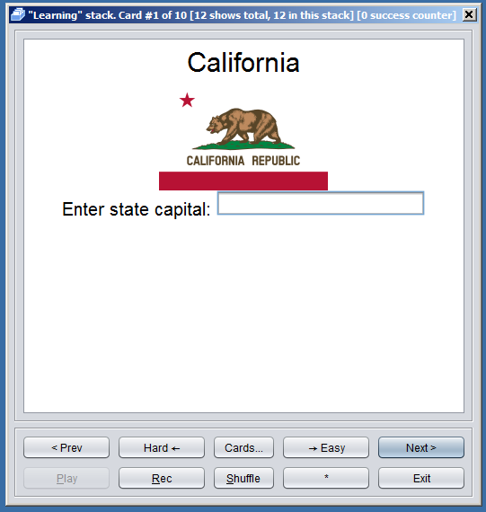

Нам досталась карточка, на которой предлагается ввести название столицы штата California. Отложим задание на потом, а пока посмотрим на панель управления, которая расположена в нижней части окна.

* “<Prev”, “Next>” - с помощью этих кнопок мы можем перейти к предыдущей или следующей карточке в стопке. При этом при нажатии “Next>” сначала будет показана оборотная сторона карточки с ответом.
* “←Hard”, ”Easy→” - эти кнопки перемещают карточку в соседние стопки. При этом если Вы несколько раз неправильно ввели ответ к карточке, то левая кнопка станет сначала желтой, а затем (если будут опять даваться неправильные ответы) красной. Если Вы, наоборот, уверенно вводите правильный ответ, то левая кнопка станет желтой, а затем зеленой, предлагая переместить карточку в стопку с более изученным материалом.
* “Cards…” - открывает окно со списком карточек, изучим это окно позже.
* “Shuffle” - перемешивает стопку.
* “\*” \- помечает карточку как “Избранное”. При этом карточка появляется в специальной стопке “Favorites”.
* “Play” - если с карточкой связан аудиофайл - проигрывает его еще раз.
* “Rec” - позволяет записать с микрофона Ваше произношение, чтобы, например, сравнить его с эталонным.

Теперь посмотрим на заголовок окна, здесь представлена некоторая полезная информация о карточке и о стопке.

* “Learning” stack - название папки.
* Card #1 of 10 - первая карточка из 10 в этой стопке
* \[12 shows total, 12 in this stack\] - показывает сколько раз карточка показывалась всего, и сколько раз с тех пор, как попала в данную стопку.
* \[0 success counter\] - показывает баланс правильных и неправильных ответов. При этом даже после длинной серии неправильных ответов достаточно один раз ответить правильно чтобы счетчик сбросился в 0. Счетчик используется для подсвечивания кнопки переноса карточки в соседнюю стопку.

Теперь попробуем выполнить задание. Правильный ответ “Sacramento”, но давайте посмотрим, что будет, если мы введем неправильный. Вводим, например, “Scramento” и нажимаем "Enter”.

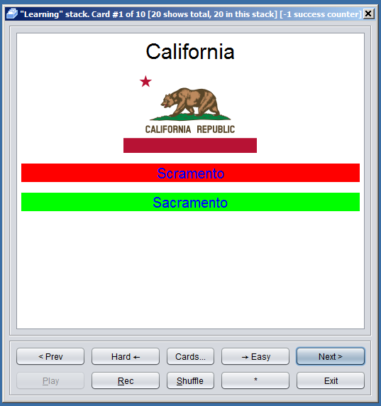

На оборотной стороне видим правильный и неправильный ответ. Так же видим уменьшившийся на 1 success counter.

Теперь попробуем ввести ответ несколько раз правильно.


После 3го раза кнопка Easy станет желтой, а после 6го - зеленой. Всё, мы выучили эту карточку в первом приближении, настало время перенести ее в стопку “Easy”, нажав на позеленевшую кнопку!

Продолжим обучение с другими карточками. Через некоторое время бОльшая часть карточек окажется в стопке Easy. Самое время сделать ревью заученных карточек. Выйдем в экран “Learning path”, нажмем на кнопку стопки “Easy”, перемешаем стопку кнопкой “Shuffle” и пройдемся по заученным карточкам. Теперь, если даны правильные ответы, система предлагает переложить карточку в стопку “Learned”, а если карточка подзабылась то наоборот в стопку “Learning”. На следующий день имеет смысл сделать ревью “Easy” и “Learned” карточек, а затем переложить несколько случайных карточек из стоки Learned в Easy и из Easy в Learning. Этим мы убедимся, что наш процесс запоминания не опирается на “соседние” в стопке карточки и карточки узнаются нами даже если они перемешаны с другими. Так же имеет смысл изредка перемешивать стопки чтобы избежать привязки к порядку следования карточек. Процесс повторяем до тех пор, пока все карточки не окажутся в стопке “Learned”. Готово! Мы выучили столицы штатов!

Теперь посмотрим, какие дополнительные возможности предоставляет экран обучения.

<a name='p_4_3'></a>
### Сессии обучения

Сверху окна обучения мы видим название сессии обучения (Learning session) и кнопки “(+)”, “(-)”, “Rename”. Сессия обучения - это запомненное программой расположение карточек по стопкам. Если, например, колоду изучают двое членов семьи, то у каждого может быть своя сессия. Или, например, Вам хочется просто поэкспериментировать с программой, но не хочется терять порядок заученных карточек. Просто создайте для  этого новую сессию.

<a name='p_4_4'></a>
### Фильтры

Справа на экране обучения расположена серия кнопок. Кнопка “Filter” позволяет выбрать, какие карточки показывать в текущей сессии. Кнопка открывает окно редактирования фильтра.

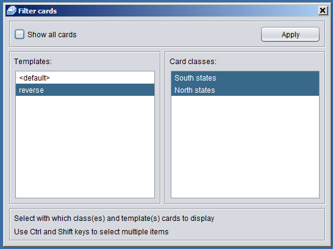

Снимите галку с чекбокса “Show all”. Теперь можно выбрать, какие карточки показывать.

Если в колоде несколько шаблонов (в нашем случае их два \- с вопросами о столице штата по названию штата и наоборот)  в левом окне вы можете выбрать (с помощью клавиши Shift) карточки с какими шаблонами показывать.

Если разработчик колоды предусмотрел разбиение карточек на классы (в нашем случае это карточки соответствующие Южным и Северным штатам) в правом окне мы сможем выбрать, какие из них показывать.

По завершению нажмите кнопку “Apply”.

Классы удобно использовать при изучении слов для разбиения карточек на глаголы, существительные и т.п. Или, например, для обозначения уровня сложности слова.

<a name='p_4_5'></a>
### Окно работы с карточками и стопками

При нажатии на кнопку “Cards…” на экране обучения или в панели управления карточки мы попадаем в окно работы с карточками и стопками. Здесь мы можем создавать и удалять свои стопки, перекладывать карточки из одной стопки в другую, смотреть статистику по каждой карточке или стопке. Это дает в руки обучаемому мощный аналитический инструмент для анализа процесса обучения.

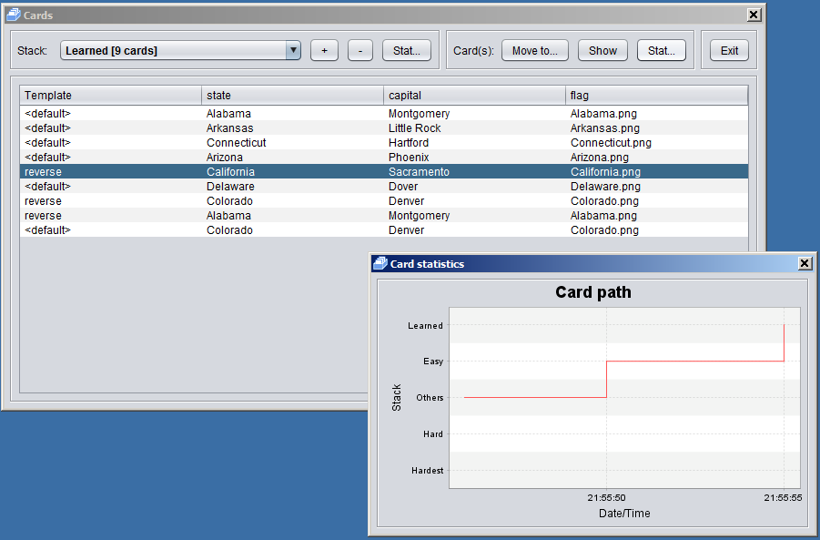

<a name='p_5'></a>
## Руководство 2 - Изготовление колоды

<a name='p_5_1'></a>
### Простая колода

Теперь изготовим собственно колоду, по которой мы обучались в первом уроке. Для начала имеет смысл выписать начальную информацию, с которой придется работать, а именно список из 10 штатов и их столиц. Это можно сделать в табличном процессоре, экспортировав затем в CSV. В нашем случае, когда колода небольшая, это можно сделать в самой программе или создать файл CSV в любом текстовом редакторе. Не забываем при сохранении указывать правильный формат Unicode.

Итак создадим в Notepad файл ‘states.txt’ следующего содержания.

```
state,capital
Alabama,Montgomery
Alaska,Juneau
Arizona,Phoenix
Arkansas,Little Rock
California,Sacramento
Colorado,Denver
Connecticut,Hartford
Delaware,Dover
Florida,Tallahassee
Georgia,Atlanta
```

и запишем его в UTF-8 (File/Save As/UTF-8)

Запускаем FlashCardsMe и нажимаем кнопку (+) (создать новую колоду). Вводим название колоды (States), и нажимаем (Ок). Видим что в списке появилась новая колода.

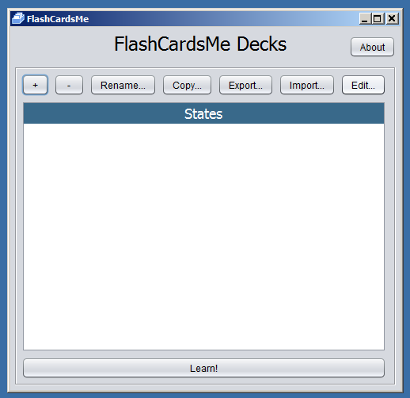

Нажимаем кнопку “Edit…”. Не путайте! Кнопка “Import…” в данном окне отвечает за загрузку готовой колоды из jfc файла а не за импортирование csv файла как могло бы показаться. В появившемся окне редактирования колоды выбираем Import: (CSV) и выбираем наш текстовый csv файл. Появится окно импорта. Так как кодировка по умолчанию у нас ANSI, а мы сохранились в UTF-8 (не забывайте делать именно так, если в Вашем файле есть русские буквы, например) то на экране будет абракадабра. Нам надо выбрать правильную кодировку (UTF-8) и разделитель (Delimiter: <,>) после чего нажать кнопку (Reload). Все, файл готов к импортированию.

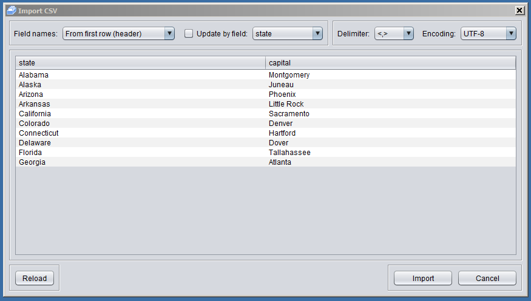

Обратим внимание, что здесь же можно задать как будут называть столбцы нашей таблицы. Также вы можете выбрать опцию “update by field”, если Вы поддерживаете список карточек в табличном процессоре и вам нужно дозагрузить или обновить информацию. В этом случае выбранное поле будет выполнять роль первичного ключа.

Нажимаем кнопку (Import) и возвращаемся на экран редактирования колоды.

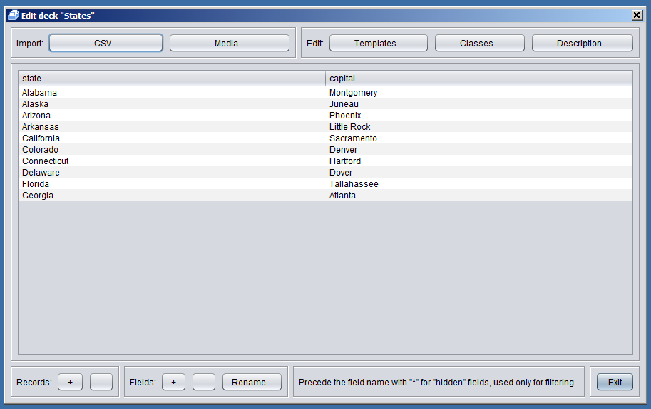

При помощи этого экрана в дальнейшем мы сможем добавить или удалить карточки (Records (+) (-)) или поля, например, сможем добавить флаг штата, но об этом позже.

Теперь нам необходимо определить, как будут выглядеть лицевая и оборотная сторона карточки. Для этого существует такое понятие, как шаблоны. Перейдем к редактированию шаблонов, нажав кнопку “Templates”.

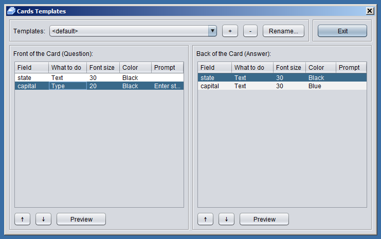

Сверху мы видим список шаблонов. Мы редактируем шаблон по умолчанию (default). Ниже мы видим представление Лицевой (Вопрос) и Оборотной (Ответ) стороны карточки. Для каждого поля наших данных (в данном случае это “state” и “capital”) мы можем задать режим отображения, щелкнув напротив названия поля в колонке “What to do”. По умолчанию все поля спрятаны. Отредактируем шаблон, как показано на рисунке. Для лицевой стороны задаем вопрос в виде названия штата (“state”:”Text”) и просьбу ввести название столицы (“capital”: “Type” - поле ввода, вопрос к полю ввода вводится в колонке “Prompt”, уменьшим также размер шрифта “Font size”:”20”). Для оборотной стороны демонстрируем названия штата черным цветом (“state”:”Text”, “Color”:”Black”), и название столицы синим цветом, при этом название столицы мы должны сравнить с тем что введено на лицевой стороне (“capital”:”Compare”, “Color”:”Blue”). Нажмем “Preview” что бы посмотреть как выглядит лицевая и оборотная стороны карточек в колоде.

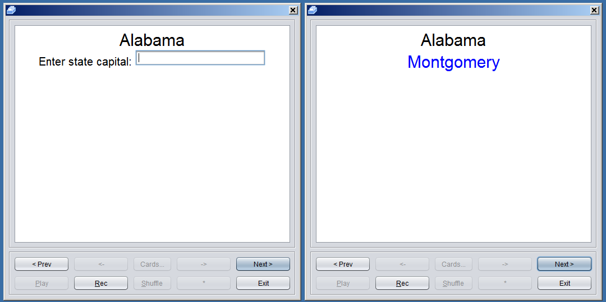

Всё, наша первая колода готова! Однако рассмотрим некоторые дополнительные возможности, которые предоставляет программа FlashCardsMe.

<a name='p_5_2'></a>
### Разные шаблоны

Иногда возникает необходимость поменять вопрос и ответ местами. Например спрашивать название штата, столица которого представлена на лицевой стороне карточки. Для этого в программе предусмотрена возможность создания нескольких шаблонов. Просто нажмите на (+) наверху страницы редактирования шаблонов и создайте столько шаблонов, сколько Вам необходимо. При этом общее количество карточек в колоде будет равно произведению количества записей в таблице данных на количество шаблонов. В нашем случае давайте создадим еще один шаблон, тогда общее количество карточек в колоде станет равным 20\. Используйте кнопки (↑) (↓) чтобы изменить порядок отображения полей.

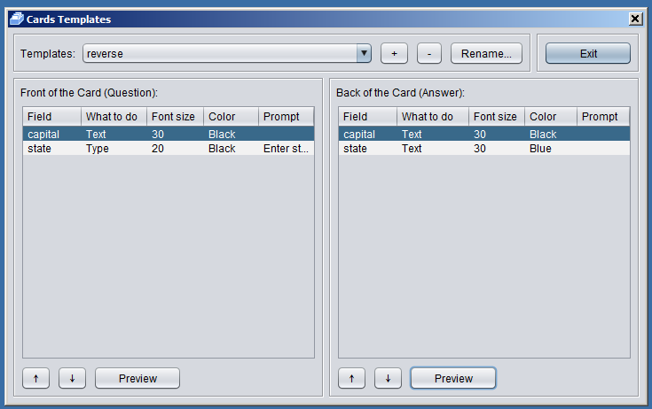

<a name='p_5_3'></a>
### Классы карточек

При изучении чего-либо с помощью карточек, иногда бывает удобно разбить карточки на группы. Так, при изучении слов, удобно бывает разбить карточки на существительные, глаголы и т.п. и изучать их раздельно. Для этого в программе предусмотрено понятие класса карточки. В нашем случае можно разбить для примера штаты на Южные и Северные. Для этого сначала надо добавить поле “class” в таблицу данных колоды. Идем на экран редактирования колоды, нажимаем “Fields: (+)”, вводим имя “\*class”. Обратите внимание на звездочку в начале имени. Так как поле нам нужно для классификации карт и мы никогда не будем отображать данные этого поля имеет смысл спрятать это поле при редактировании шаблонов. Именно такую функцию выполняет звездочка. Теперь вводим в новое поле класс для всех штатов.

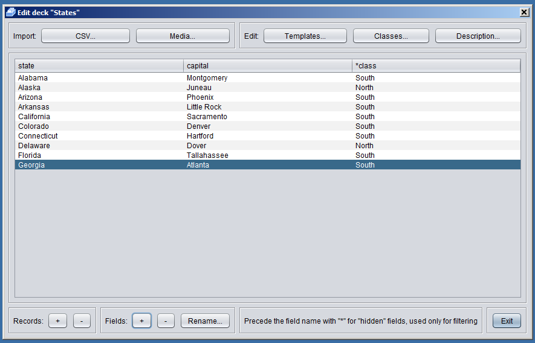

Далее нажимаем кнопку “Edit: Classes”. Нажимаем кнопку (+) и вводим название класса “South states”. В качестве условия вводим что поле “\*class” должно содержать (быть равным) “South”. Повторяем процедуру для “North classes”.

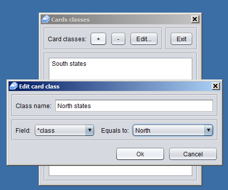

Готово! Теперь наши карточки разбиты на классы, и при изучении колоды мы сможем выбрать, какие именно штаты мы будем изучать.

<a name='p_5_4'></a>
### Изображения и аудиофайлы

При работе с карточками полезными оказываются различные медиаданные. При изучении иностранных языков неоценимую пользу оказывают аудиофайлы, в которых профессиональные преподаватели произносят слова или слоги. В нашем случае, для усиления ассоциативных связей, мы можем отображать не только название штата, но и его флаг. В программе FlashCardsMe существует возможность отображать изображения и воспроизводить аудиофайлы при демонстрации лицевой или оборотной стороны карточки. Для примера покажем как отображать флаг на лицевой стороне карточки.

Сначала подготовим изображения флагов (их можно скачать с википедии). Имена файлов будут, скажем, “Название_Штата.png”. Поместим все файлы с изображениями в произвольную директорию.

Далее идем на экран редактирования колоды и добавляем новое поле “flag”, в которое старательно вписываем названия файлов с изображением флага. Разумеется, удобнее это сделать в табличном редакторе с использованием формул. Именно такой алгоритм работы мы рекомендуем - подготавливать данные для колоды в табличном редакторе и затем только импортировать данные в программу. Однако у нас колода небольшая и сделать всё можно вручную.

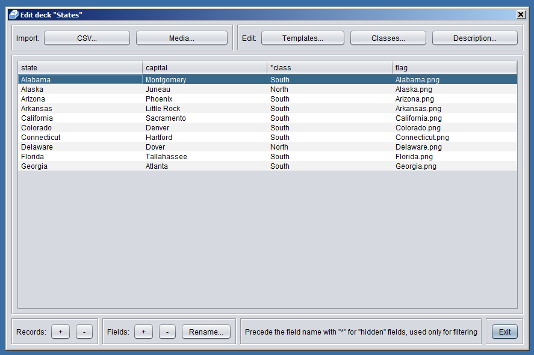

Далее необходимо импортировать медиафайлы непосредственно в колоду. Для этого жмем кнопку “Import: Media” и выбираем подготовленные файлы. Если необходимо импортировать всю директорию идем в директорию, нажимаем Ctrl-A или выбираем несколько файлов с помощью Shift-Click.

Теперь флаг необходимо отобразить на лицевой стороне для шаблона “default” или на оборотной для шаблона “reverse”. Сделаем это в окне редактирования шаблонов.

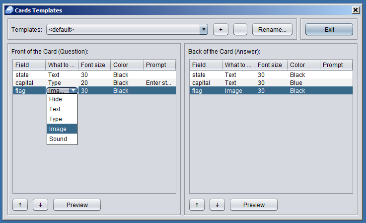

Посмотрим на лицевую и оборотную сторону для шаблона default

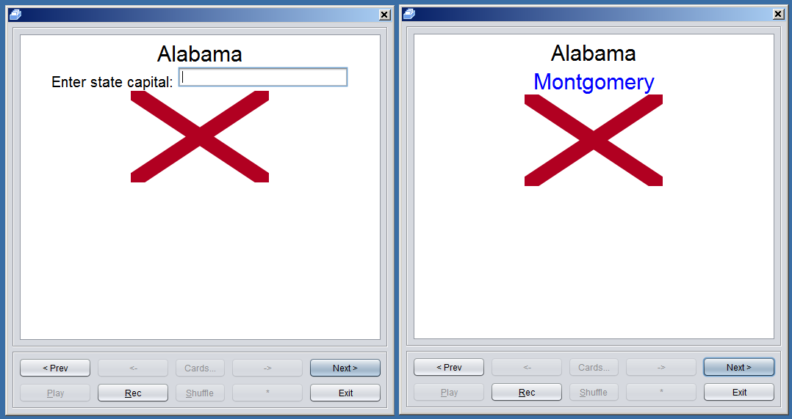

Готово!

<a name='p_5_5'></a>
### Экспорт готовой колоды

Таким образом, мы рассмотрели основные возможности создания колод в программе FlashCardsMe. Теперь экспортируем готовую колоду для распространения. Программа FlashCardsMe автоматически запакует данные колоды и все медиафайлы в единый архив, готовый к распространению на форумах или каким либо иным способом. Для этого идем на основной экран программы, выбираем нашу колоду и нажимаем кнопку “Export…”. Выбираем директорию и имя файла, нажимаем “Save”. Наша колода готова! Именно этим файлом мы пользовались в первом уроке.
